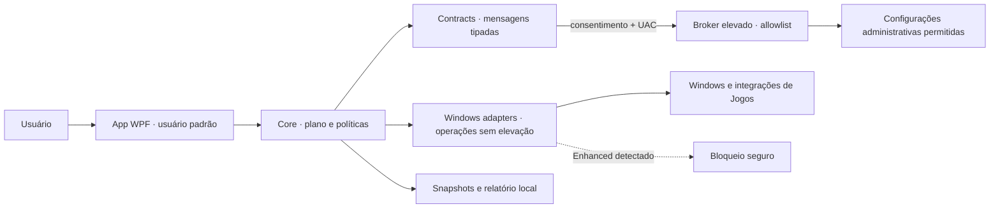

# Arquitetura

Este documento descreve a arquitetura-alvo e os limites entre componentes. Uma classe ou fluxo só deve ser tratado como entregue quando existir implementação e teste correspondente.

## Objetivos

- manter a interface sem privilégio administrativo permanente;
- representar cada alteração como ação pequena, tipada e reversível;
- separar descoberta Windows de política de produto;
- impedir que um perfil amplie silenciosamente o escopo de uma ação;
- oferecer progresso real por etapas, não uma animação temporal;
- suportar instalação personalizada do FiveM Legacy;
- bloquear GTAV Enhanced até existir adaptador próprio;
- permitir testes sem alterar a máquina do desenvolvedor.

## Áreas de produto

O shell separa a experiência em **Visão geral**, **Otimizar**, **Sistema**,
**Aplicativos** e **Jogos**. Otimizar usa o escopo `GeneralWindows`: funciona
sem FiveM ou GTA V e seleciona exclusivamente ações declaradas para o PC geral.
Jogos abre o catálogo de títulos. O card do FiveM leva a um hub dedicado que
mantém Jogos como categoria ativa e separa os acessos ao otimizador do jogo, ao
otimizador geral e ao histórico/restauração. O otimizador especializado configura
o mesmo motor no escopo `FiveMLegacy`; somente esse escopo aceita ações de
instalação, cache, processo, configuração ou gráficos do FiveM/GTA V Legacy.
GTAV Enhanced bloqueia o escopo especializado, mas nunca bloqueia uma análise
geral do Windows.

Aplicativos organiza o software em cinco superfícies: **Descobrir**,
**Atualizações**, **Gerenciados**, **Inventário** e **Inicialização**. As três
primeiras pesquisam, instalam, listam, atualizam e desinstalam pacotes das
origens confiáveis `winget` e `msstore`; atualizações podem ser selecionadas e
executadas sequencialmente ou ocultadas por pacote em preferência local. Cada
mutação exige confirmação explícita e mostra identidade, origem e limitação de
rollback. Inventário continua sendo a leitura local dos programas registrados,
e Inicialização permanece somente leitura. Busca, contagens e resultados
parciais ficam na própria página; as superfícies nativas do Windows permanecem
como ações secundárias. Sistema apresenta internamente apenas as informações essenciais do hardware já
coletado pelo aplicativo e consulta, somente para leitura, a proteção de
antivírus, firewall e configuração de atualizações automáticas pela API nativa
da Central de Segurança do Windows. A página não abre superfícies externas:
mostra apenas dados lidos no próprio Ralven e o painel de jogos do Windows, que
lê o Modo de Jogo e a gravação histórica em segundo plano e, com confirmação
explícita, aplica somente as duas ações tipadas já existentes.

`WindowsSystemHealthInspector` faz três consultas independentes e preserva
resultados parciais. Falha da API ou serviço indisponível resulta em estado
indisponível, nunca em uma afirmação de proteção boa ou ruim. A leitura de
configuração automática não afirma que não existem atualizações pendentes; essa
consulta não usa broker, elevação, PowerShell, linha de comando ou rede.

Esse painel não recebe IDs ou comandos escolhidos pela interface. O serviço de
aplicação constrói uma lista fixa com `GameModeRegistryAction` e
`GameDvrRegistryAction`, executa-a como usuário padrão pelo mesmo motor
transacional e armazenamento local de histórico, e valida o estado depois da
escrita. O fluxo não exige que o FiveM esteja instalado, mas a aplicação e a
restauração são bloqueadas enquanto algum processo do FiveM estiver ativo. A
presença do processo é verificada novamente na fronteira de cada escrita e uma
falha nessa verificação bloqueia a alteração. Apenas a compensação imediata do
snapshot criado pela própria execução falha pode restaurar o estado anterior;
uma restauração solicitada depois continua bloqueada com o FiveM aberto. O painel não amplia o planejador
de perfis, não usa o broker e não cria um executor genérico de registro.

`WindowsApplicationInventoryInspector`, em `Ralven.Windows`, faz a leitura como
usuário padrão e devolve um snapshot normalizado com completude separada por
área. Ele não lê nem executa `UninstallString`, não lê nem escreve
`StartupApproved`, não altera o registro e não atravessa o broker.

`WinGetApplicationPackageService`, também em `Ralven.Windows`, localiza somente
o alias oficial `winget.exe` do usuário e executa listas fixas de argumentos
pelo `ProcessCommandRunner`. As consultas são serializadas porque compartilham
o índice local do WinGet e percorrem somente `winget` e `msstore`, preservando
resultado parcial quando uma origem falha. Instalação, atualização e
desinstalação aceitam apenas um ID validado do snapshot atual, usam
correspondência exata e preservam as verificações de integridade do WinGet.
Texto descoberto nunca vira comando, não há shell, `--force`,
`--ignore-security-hash`, `--allow-reboot`, broker ou elevação permanente do
Ralven. O instalador do fabricante ainda pode abrir ou solicitar UAC. Esse
fluxo é separado do motor transacional de otimizações e do atualizador assinado
do próprio Ralven porque o instalador de terceiros controla a alteração e o
Ralven não oferece rollback.

`JsonApplicationUpdateIgnoreStore`, em `Ralven.App`, persiste apenas chaves
normalizadas `origem|id` em `%LOCALAPPDATA%\Ralven`; não guarda comandos,
argumentos, versões nem dados pessoais. A gravação usa arquivo temporário na
mesma pasta antes da substituição. Ignorar afeta apenas a apresentação e a
seleção em lote, nunca executa uma operação no sistema.

### Bandeja do sistema

`TrayIconService` mantém o `System.Windows.Forms.NotifyIcon` somente como
integração com a área de notificação do Windows. O clique direito continua
entrando pelo `ContextMenuStrip` associado ao ícone, mas o evento de abertura
é cancelado e encaminhado ao `ContextMenu` WPF do shell. Assim, o Windows
continua responsável pelo ciclo de vida do ícone, tooltip e notificações,
enquanto o Ralven controla tema, tipografia, ícones, foco e estados do menu.

Com **Minimizar para a bandeja** ativo, o ícone permanece disponível enquanto
o aplicativo estiver aberto. Clique esquerdo restaura/ativa a janela; clique
direito abre o menu rápido junto ao ponteiro; perder foco ou escolher uma ação
fecha o menu pelo comportamento do próprio `ContextMenu`. As ações reutilizam
os fluxos existentes do shell: abrir, navegar ao Otimizador, alternar o monitor
local de sessão, verificar atualizações, abrir Configurações e sair. O menu não
executa otimizações nem instalações diretamente e mantém as confirmações já
exigidas por esses fluxos.

O posicionamento usa `PlacementMode.MousePoint`, que acompanha o monitor do
ícone e deixa o `Popup` WPF corrigir colisões com as bordas da área de trabalho.
O manifesto `PerMonitorV2` continua sendo a fonte de escala por monitor. A API
gerenciada de `NotifyIcon` não expõe um retângulo estável do ícone; portanto a
âncora visual é o ponteiro usado para invocar o menu, sem tentar acessar a
estrutura interna da barra de tarefas.

## Diálogos WPF

As janelas secundárias compartilham `DialogWindow`, com modalidade nativa,
backdrop visual e limites por monitor/DPI. A escolha por fluxo, os estilos e
a validação reproduzível estão em [Janelas secundárias e diálogos](dialogs.md).

## Componentes

## Autenticação Firebase

A conta usa diretamente a Firebase Authentication REST API. `FirebaseAuthService`
é a única camada de rede; DTOs, armazenamento DPAPI, estado de autenticação e
mapeamento de erros permanecem separados. Apenas o refresh token opcional é
persistido e protegido para o usuário Windows; senha e ID token nunca vão para
disco ou logs. O ID token fica em memória, é renovado antes de vencer e deve
seguir como `Authorization: Bearer` apenas para um backend HTTPS que o valide e
use o Firebase UID como identificador interno. No Worker, a verificação fica em
`infra/cloudflare-worker/src/auth/firebaseIdToken.js` (RS256 + JWKS Google,
`aud`/`iss`/`exp`/`sub`). Com `emailVerified=false`, o estado é
`EmailVerificationRequired` e recursos autenticados ficam bloqueados.

O estado carregado pelo `accounts:lookup` identifica os provedores vinculados e
os fatores MFA. Senha, Google e TOTP são tratados como capacidades independentes
da mesma UID: vinculação, desvinculação e mudanças sensíveis exigem
reautenticação; a última forma de acesso não pode ser removida. A primeira senha
é vinculada por `accounts:signUp` com o ID token atual, preservando a proteção
contra enumeração do Identity Platform. Troca de e-mail usa verificação prévia do
novo endereço (`VERIFY_AND_CHANGE_EMAIL`). Um token Google de outro UID é
rejeitado antes de substituir a sessão local.

TOTP usa os endpoints MFA nativos do Identity Platform. O segredo só aparece
durante a ativação, que apenas termina após um código válido. O login entra em
`MfaChallengeRequired` até confirmar o segundo fator. Códigos de recuperação são
aleatórios, armazenados apenas como hash no Worker, exibidos uma única vez e
consumidos atomicamente; seu uso remove o fator perdido e revoga refresh tokens,
obrigando novo login. Criar, substituir ou apagar esses códigos exige token com
autenticação recente.

O vínculo opcional com o Discord parte da mesma UID autenticada. O aplicativo
solicita um código de dez minutos e uso único; D1 guarda apenas seu HMAC e o ID
numérico do Discord. O bot oficial resgata o código e consulta cargos derivados
dos entitlements server-side por rotas protegidas por um segredo de serviço
distinto. E-mail, nome do Discord e código em texto puro não são persistidos.

`POST /account/profile` é a primeira rota de produto sobre esse verificador:
como o Firebase só administra e-mail/senha/uid, essa rota guarda o que ele
não guarda — nome, sobrenome e um nome de usuário único (case-insensitive) —
em `account_profiles`, sempre indexado pelo UID já validado do token, nunca
por um valor enviado pelo cliente. A criação do perfil exige ID token com
`email_verified=true` e a aceitação da versão vigente dos termos; até ambos
existirem, a conta fica em `ProfileCompletionRequired`, não em `SignedIn`.
`AccountProfileService` (`Ralven.App/Services`) chama essa rota depois
da confirmação de e-mail; se o usuário escolhido já existir, a resposta é
`409 username-taken` e a conta Firebase já criada é preservada — a janela de
conta pede outro nome de usuário em vez de descartar o cadastro. A exclusão
autenticada é coordenada pelo Worker: bloqueia assinaturas que exigem
cancelamento, grava cutoff e job durável, remove a conta Firebase e só depois os
dados em D1. Um agendamento retoma jobs interrompidos sem permitir que tokens
anteriores recriem dados; assim, uma falha de identidade não deixa uma conta
ativa sem seus dados associados.

## Cobrança e entitlements

A cobrança fica no Worker e no D1, separada da autenticação
Firebase e das políticas de otimização. O aplicativo pode ler apenas o snapshot
server-side de acesso da própria UID em `GET /account/entitlements`; IDs e
estados do provedor não são contratos do cliente. Eventos do Asaas são
autenticados por token dedicado, deduplicados e reconciliados contra o recurso canônico e um
checkout intent criado pelo servidor. O corpo da notificação, um redirect de
checkout ou o estado `authorized` de uma assinatura não concedem Pro. Veja
[Cobrança e acesso pago](billing.md) para o contrato e os bloqueadores de
ativação. `CloudflareBillingService` consulta oferta/status e solicita checkout ou
cancelamento autenticado; `MainWindow.Billing.xaml.cs` coordena a página Pro e
descarta respostas após troca de conta. URLs externas são restritas ao checkout
hospedado do Asaas. Preço e chave de oferta versionada são
definidos pelo servidor; a confirmação na UI é invalidada se a oferta mudar.
Pagamentos reconciliados mantêm períodos estáveis no ledger D1. Cancelamento
confirmado interrompe renovação e preserva o período pago; somente então a
exclusão do perfil pode remover o vínculo. Uma criação incerta continua bloqueada.

| Projeto                  | Responsabilidade                                                    | Não deve conhecer                                        |
| ------------------------ | ------------------------------------------------------------------- | -------------------------------------------------------- |
| `Ralven.App`       | WPF, navegação, prévia, progresso e confirmação                     | APIs administrativas ou detalhes de registro             |
| `Ralven.Contracts` | DTOs, IDs, estados (inclusive transacionais), erros e contratos entre processos | WPF ou implementação Windows                  |
| `Ralven.Core`      | casos de uso, composição de perfis, políticas, transação e rollback | controles visuais ou comandos shell                      |
| `Ralven.Windows`   | descoberta de hardware/instalação e adaptadores Windows/Jogos       | decisão de qual perfil o usuário deve escolher           |
| `Ralven.Broker`    | executor elevado com allowlist mínima                               | navegação, telemetria ou lógica de produto ampla         |
| `Ralven.Tests`     | contratos, políticas, falhas, rollback e doubles de sistema         | dependência de uma instalação real para testes unitários |

## Fronteira de confiança

O fluxo remoto opcional do Ralven AI está documentado em
[`docs/ralven-ai.md`](ralven-ai.md). O modelo produz texto, a escolha de um
perfil padrão e no máximo uma solicitação de ferramenta local fechada. O App
revalida essa solicitação, que só pode atualizar diagnóstico, navegar para uma
tela existente ou preparar a revisão de um plano; ela nunca produz um plano
executável nem atravessa diretamente a fronteira privilegiada.



O broker não é uma “shell como administrador”. Contratos não carregam scripts nem comandos livres.

## Modelo de domínio

### Diagnóstico

Um snapshot de diagnóstico deve conter fatos, não recomendações:

- edição e caminho canônico da instalação;
- versão conhecida do cliente;
- processos ativos relacionados ao diretório;
- CPU, RAM, GPU, VRAM, sistema e espaço livre;
- presença e tamanho de caches reconhecidos;
- estado das configurações suportadas;
- alertas de ambiguidade, permissão ou corrupção.

Políticas do Core transformam esse snapshot em recomendações.

### Ação

Cada ação tem contrato equivalente a:

```text
id + versão
descrição e evidência
escopo de leitura/escrita
pré-condições (incluindo pré-requisitos de outras ações, quando existem)
estado atual e estado desejado
risco, privilégio e criticidade (aborta o restante da execução se falhar?)
aplicar + verificar + restaurar
progresso por etapas
versões do Windows suportadas
documentação: como detectar, como confirmar, como desfazer, riscos/limitações
```

IDs são estáveis para que relatórios e snapshots continuem interpretáveis entre versões. Os campos de pré-requisito, criticidade, versões do Windows e documentação vivem em `ActionMetadataDto`/`OptimizationActionDefinition`.

Pré-requisito, criticidade e privilégio alimentam o motor de execução. Os quatro campos de documentação (`DetectionSummary`, `ConfirmationSummary`, `UndoSummary`, `RiskLimitations`) são obrigatórios por teste, participam da verificação de integridade do plano e aparecem de forma localizada nos detalhes expansíveis de cada ação durante a revisão do plano.

`ActionMetadataDto.MatchesExactly` é a única comparação de metadados do projeto. O broker elevado e o catálogo Windows rejeitam um plano cujos metadados divergem do catálogo local, e ambos delegam a esse método — antes cada fronteira repetia a lista de campos e as duas versões haviam divergido.

### Plano

Um plano é uma lista ordenada e imutável de ações resolvidas para aquele diagnóstico. Depois que o usuário confirma:

- nenhuma ação nova pode ser adicionada;
- caminhos não podem ser recalculados para outro alvo;
- conflito entre ações invalida o plano;
- o broker recebe somente o subconjunto privilegiado já aprovado.

`OptimizationScope` é ortogonal ao fato detectado em `FiveMEdition`:

- `GeneralWindows` aceita uma máquina sem FiveM, com Legacy ou com Enhanced,
  mas o planejador só inclui definições explicitamente compatíveis com o escopo
  geral;
- `FiveMLegacy` preserva o bloqueio quando a instalação não foi encontrada e o
  bloqueio seguro do Enhanced;
- toda definição nasce fechada para `FiveMLegacy`; uma ação só entra no plano
  geral quando o catálogo a marca explicitamente como compartilhada;
- runtime e broker reconstroem o plano com o mesmo escopo antes de resolver
  handlers, portanto trocar o campo na UI ou no JSON não amplia a allowlist.

O valor zero de `OptimizationScope` continua sendo `FiveMLegacy` para que um
journal anterior à introdução do campo mantenha a semântica original. O escopo
não é inferido por categoria ou prefixo de ID, pois o catálogo histórico contém
IDs e categorias que atravessam as duas experiências.

O planejamento é uma **função pura**: `PlanBuilder.Build(request, context)` produz sempre o mesmo plano para a mesma entrada. Tudo que não é determinístico — identidade do plano, instante de criação e catálogo — entra por `PlanBuildContext`, resolvido pelo chamador (`PlanBuildContext.New` para um plano novo, `PlanBuildContext.For` para reconstruir um plano existente). O planejador não lê relógio, disco, registro nem estado ambiente.

Isso é o que torna a validação possível: tanto o broker elevado quanto `WindowsOptimizationRuntime` **replanejam** o plano recebido e o comparam campo a campo. A reconstrução da requisição canônica vive em `PlanBuilder.CanonicalRequestFor`, em um único lugar, em vez de repetida em cada fronteira.

### Resultado

`ActionExecutionOutcome` (`Ralven.Contracts`) é o estado semântico usado por progresso e relatório:

- `Verified` — máquina já estava no estado desejado; nenhuma escrita ocorreu;
- `Applied` — alteração e pós-condição confirmadas;
- `Skipped` — pré-condição, opção ou pré-requisito ausente, sem erro;
- `Warning` — aplicado com ressalva reportável;
- `Failed` — erro genuíno; a própria ação foi revertida;
- `RolledBack` — revertida com sucesso após falha;
- `RollbackFailed` — requer atenção e fica destacado no relatório;
- `NotRun` — não executada porque uma falha crítica ou cancelamento interrompeu o restante da run.

O relatório só indica sucesso para uma transação `Committed` sem ações
pendentes, não executadas ou com falha. As mensagens de diagnóstico gravadas no
journal são preservadas no resultado e no relatório técnico; uma razão explícita
de falha ou omissão tem precedência sobre mensagens anteriores. Após consultar
o resultado, o usuário pode preparar outra otimização preservando o perfil e as
preferências selecionadas. Cancelamento da execução local também entrega um
resultado e atualiza o histórico.

Esse enum é independente do estado transacional do journal
(`ActionJournalState`), que continua controlando elegibilidade de
rollback, e do estado da transação inteira (`TransactionState`).

Os três vivem em `Ralven.Contracts` (`OptimizationEnums.cs` e
`TransactionEnums.cs`) porque são vocabulário compartilhado entre App, Windows
e Broker — antes App e Broker importavam `Ralven.Windows.Engine` só para
enxergar o estado da transação.

**Contrato durável.** Os três são persistidos *pelo nome* (camelCase) em
`%LOCALAPPDATA%\Ralven\Transactions\{id}.json`, que sobrevive à versão
que o escreveu. Renomear, remover ou renumerar um membro torna journals
existentes ilegíveis e destrói silenciosamente a capacidade de rollback de quem
já tem o aplicativo instalado. Membros só podem ser **acrescentados ao final**.
`PersistedEnumContractTests` congela nomes, valores e strings serializadas
justamente para impedir que isso passe despercebido.

`ActionExecutionOutcome.Warning` está definido, é contado por
`OptimizationReportDto.WarningCount` e localizado, mas nenhuma ação o emite
ainda.

## Perfis

Leve, Médio e Agressivo são seleções versionadas de ações e parâmetros. Eles não implementam operações diretamente e continuam gratuitos.

[Ultra](ultra.md) adiciona preferências pessoais ao plano geral do Windows,
sem ampliar o enum de perfis. `PersonalOptimizationPolicy` compõe opções
canônicas; runtime e broker revalidam essa composição. `PersonalWorkspaceService`
cuida de rotinas, observações e medições locais limitadas. A preferência exclusiva
de resposta consistente do ponteiro seleciona uma ação tipada, verificada e
reversível por `SystemParametersInfo`; ela não entra em planos gratuitos. O acesso
Pro é revalidado na entrada dos serviços; histórico e rollback
não dependem da assinatura.

```text
Perfil → Política de hardware → Ações propostas → Prévia do usuário → Plano imutável
```

Isso permite:

- testar cada ação isoladamente;
- comparar versões de um perfil;
- impedir que “Agressivo” se torne sinônimo de mudanças irreversíveis.

A prévia atual explica o plano imutável do perfil, mas não funciona como editor
arbitrário de ações. Opções de manutenção que exigem consentimento próprio são
controles separados, não itens pré-marcados na composição do perfil. Cache é um
módulo de manutenção separado e não entra implicitamente nesses perfis.

## Adaptador FiveM Legacy

Responsabilidades:

- localizar instalação padrão e personalizada por camadas: seleção manual
  validada, processo em execução, cache com fingerprint do executável, App
  Paths/registro de desinstalação, atalhos do usuário/Start Menu e diretórios
  conhecidos; a busca nunca percorre o disco inteiro nem perfis de outros
  usuários;
- aceitar uma raiz Legacy somente com `FiveM.exe`, `FiveM.app` e
  `FiveM.app\data`, todos canonizados e sem reparse points; dados CitizenFX
  isolados, caminhos quebrados e instalações parciais não são instalação;
- priorizar uma escolha manual, processo ou cache ainda válido; se restarem
  várias raízes automáticas válidas sem uma fonte decisiva, declarar estado
  ambíguo e pedir que o usuário selecione uma raiz, em vez de alterar uma
  instalação arbitrária;
- invalidar o cache quando o executável some ou muda de tamanho/data e voltar
  à descoberta completa após movimentação, reinstalação ou atualização;
- validar `CitizenFX.ini` e `IVPath` sem reescrevê-los por conveniência;
- mapear somente diretórios conhecidos sob `FiveM.app`;
- identificar processos por caminho da imagem, não só por nome;
- ler e editar `gta5_settings.xml` preservando schema e nós desconhecidos;
- proteger `game-storage`, `nui-storage`, plugins e autenticação;
- calcular tamanho de caches sem segui-los para fora do root canônico.

O parser XML altera apenas chaves presentes. Um arquivo inválido gera ação de reparo separada; nunca é substituído por um template genérico.

### Monitor local de sessão FiveM

A coleta de métricas ao vivo só roda com a Visão geral selecionada e a janela
visível, ativa e não minimizada. Navegação, minimização, perda de foco e bandeja
pausam o timer e cancelam a amostra em curso; a retomada descarta resultados
antigos e obtém uma amostra nova sem sobrepor coletas. A leitura da GPU consulta
a categoria de contadores em lote, pareando as duas amostras pelo nome da
instância. Instâncias sem par não viram utilização inventada.

O painel oferece uma série selecionada entre CPU, GPU, memória, disco e rede,
com percentuais em escala fixa e throughput em escala dinâmica explicitamente
rotulada. Quando uma raiz FiveM Legacy já foi diagnosticada, o alvo FiveM troca
a captura geral por CPU e working set agregado apenas dos processos com nome e
imagem validados dentro dessa raiz. Essa leitura usa contabilidade do processo
fornecida pelo Windows; não lê conteúdo da memória, não usa hook/injeção e não
estima GPU, disco, rede, FPS ou frame time por processo.

Essa suspensão é exclusiva das métricas de apresentação. O monitor de sessão
continua consultando a presença a cada cinco segundos; mudanças de estado
atualizam as restrições do otimizador mesmo com a janela oculta. Rodadas sem
mudança não recalculam apresentação oculta. Ao reabrir, a duração é atualizada
a partir do início registrado. Resultados de uma execução anterior do monitor
são descartados após parar/reiniciar. Procedimento e limites de medição em
[Desempenho do aplicativo](app-performance.md).

O monitor da Visão geral é iniciado manualmente e permanece ativo enquanto o
Ralven estiver aberto, inclusive na bandeja. Ele usa exclusivamente a raiz
Legacy já diagnosticada e só confirma uma sessão quando o nome allowlisted e o
caminho canônico da imagem do processo pertencem à instalação validada, sem
atravessar reparse points. Leituras incompletas são tratadas como
indeterminadas, e duas ausências confirmadas consecutivas são exigidas para
encerrar uma sessão.

Esse monitor é somente leitura: o estado e a duração ficam apenas em memória,
não há persistência, telemetria, rede, broker nem alteração no jogo ou no
Windows. Ele termina quando o aplicativo fecha e, por isso, não autoriza plano
de energia, prioridade, afinidade, timer resolution ou qualquer outra ação
mutável condicionada ao ciclo de vida do FiveM.

## Guard de GTAV Enhanced

O Enhanced tem launcher, ciclo de processo e cache diferentes. Até o adaptador próprio existir:

1. a descoberta identifica sinais inequívocos da edição;
2. o planejamento retorna um bloqueio de plano (`PlanBlockCode.EnhancedNotSupported`) com explicação;
3. nenhum fallback Legacy é tentado;
4. o usuário recebe links para o estado de suporte do projeto;
5. testes garantem que nenhum executor seja chamado.

Quando o suporte for implementado, ele deve ser um adaptador separado e passar por nova pesquisa de caminhos, rollback e políticas.

## Execução, progresso e cancelamento

Progresso é calculado por passos concluídos e pesos declarados. Mensagens devem descrever ações reais, por exemplo “Validando snapshot gráfico”, não frases genéricas. O progresso também expõe etapa atual / total de etapas (`CompletedSteps`/`TotalSteps` em `WindowsActionProgress` e `AppProgressUpdate`) e o outcome de cada etapa. A interface do Otimizador mostra apenas a etapa atual e a imediatamente anterior, mais escura, para manter o acompanhamento claro sem expor uma lista técnica de ações.

## Diagnósticos essenciais e dados opcionais

`IAnonymousTelemetryService` é uma fronteira da camada App, separada do
serviço de otimização. Após a confirmação do aviso de privacidade vigente, o
serviço permanece habilitado para diagnósticos essenciais allowlisted. As
preferências persistidas `AppSettings.ShareAnonymousTelemetry` e
`AppSettings.ShareCrashReports` são mantidas por compatibilidade e formam o
controle único `ShareOptionalReports`: ambas nascem como `true`, mas qualquer
opt-out legado falso prevalece. Quando o controle é desativado, campos
opcionais também são retirados de eventos que já estavam na fila. O
contrato `AnonymousTelemetryEvent` não aceita payload livre: contém o nome
allowlisted do evento, duração, versão, categoria de erro allowlisted em
falha e, desde a versão 2 do consentimento, um perfil de hardware (CPU/GPU/
RAM em faixas) e os IDs das ações aplicadas. O transporte ativo é
`CloudflareTelemetryService.cs`
(`LocalTelemetryQueue`/`CloudflareTelemetryTransport`/
`QueuedCloudflareTelemetryService`), que envia o evento completo para o
Worker em `infra/cloudflare-worker/`. O FormSubmit foi removido do código —
não existe mais um transporte alternativo. O relato de bug segue o mesmo
padrão: `CloudflareBugReportService.cs` envia para a rota `/bugs` do Worker,
somente texto (sem anexo/captura de tela, sem R2). Qualquer erro de transporte é
suprimido localmente para não alterar a execução nem os logs. Detalhes de
privacidade: [telemetry.md](telemetry.md) e [bug-reports.md](bug-reports.md).

O dashboard administrativo permanece fora do processo distribuído e consulta
somente rotas autenticadas do Worker. As consultas de produto agregam, no D1,
telemetria, contas, updater, cobrança e uso do Ralven AI; nenhum identificador
de conta/provedor ou conteúdo interativo sai dessas consultas. Filtros de
versão e ambiente se aplicam apenas aos domínios que possuem esses campos, e o
período é traduzido para a coluna temporal própria de cada tabela.

### Relatório de falhas e configuração centralizada

`ICrashReportingService` (implementação `SentryCrashReportingService`) é
outra fronteira da camada App, análoga à de telemetria e opcional; nunca é
referenciada por `Core`/`Windows`/`Broker`. `MainWindow` a inicializa uma única
vez somente quando `ShareOptionalReports` e o aviso vigente autorizam,
usando
`RemoteServicesOptionsLoader` para ler o DSN de um arquivo de configuração
por ambiente (`Config/appsettings.{Development,Production}.json`, com
`appsettings.json` como base sem DSN) — nenhum identificador remoto fica
hardcoded em código-fonte. `AppEnvironment.Resolve()` decide entre
Development/Production (variável `RALVEN_ENVIRONMENT`, com fallback
por configuração de build), permitindo separar no Sentry os erros do
desenvolvedor dos erros de usuários finais sem duplicar DSN nem projeto.
Todo evento passa por `CrashReportSanitizer` (reaproveitando
`ReportSanitizer`) antes de sair do processo. Detalhes: [telemetry.md](telemetry.md).

`App` registra as fronteiras globais do WPF (`DispatcherUnhandledException`,
`UnhandledException` e `UnobservedTaskException`). A primeira, e falhas de
startup que ainda alcancem o Dispatcher, usam `ErrorDialog`: uma superfície
localizada com orientação simples, detalhes técnicos sanitizados sob demanda e
ações de cópia, reabertura ou fechamento. `UnhandledException` de thread sem
Dispatcher só registra e tenta reportar, pois o processo pode já estar sendo
encerrado. As falhas esperadas de fluxos específicos continuam no contexto que
as recupera (estado inline, resultado transacional ou diálogo da funcionalidade),
sem promover todo problema a uma falha fatal.

## Interrupção de otimização pela interface

O `MainWindow` não encerra nem chama `MainViewModel.CancelOptimization()`
diretamente enquanto `IsBusy` for verdadeiro. Ambos os caminhos de interface
(botão de cancelar e fechamento da janela, inclusive pelo ícone da bandeja)
passam por `OptimizationConfirmationWindow`, um modal localizado e temático.
Ao confirmar, o view-model solicita o token de cancelamento já existente; a
execução mantém a garantia de concluir ou reverter a etapa atual. Um fechamento
confirmado agenda o encerramento somente depois que `StartOptimizationAsync`
retorna. O evento de sessão do Windows é exceção: não mostra modal e não impede
logoff/desligamento.

A execução do usuário padrão roda com `WindowsTransactionOptions.IsolateFailures = true`: cada ação do plano é aplicada, validada e registrada como uma mini-transação independente.

- uma falha genuína reverte somente a própria ação (rollback atômico existente, sem afetar as demais);
- uma ação cujo pré-requisito não teve sucesso (`Prerequisites` em `ActionMetadataDto`) é marcada `Skipped`, nunca executada;
- uma ação crítica (`IsCritical`, hoje as verificações de processo FiveM/GTA V) que falha aborta as ações independentes restantes, que ficam `NotRun`;
- a transação final é `Committed` somente se nenhuma ação falhou; caso contrário `CommittedWithErrors`, e o relatório (`OptimizationReportDto`, construído por `OptimizationReportBuilder`) nunca marca a run como bem-sucedida.
- o broker elevado continua no modo estrito (tudo-ou-nada), pois normalmente delega uma única ação administrativa por vez.

**Falha da fase elevada não desfaz a fase de usuário padrão.** Quando o
broker falha ou o UAC é cancelado, `AppOptimizationService` não chama mais
um rollback das ações de usuário padrão já confirmadas — isso causava o
efeito de "várias ações falhando de uma vez" quando na verdade só uma ação
administrativa havia falhado (ver investigação de 24/07/2026 e correção de
26/07/2026 no `PROJECT_STATE.md`). Em vez disso,
`WindowsTransactionEngine.MarkAdministratorPhaseFailedAsync` marca somente
a(s) ação(ões) administrativa(s) ainda pendente(s) como `Failed` no journal,
preservando intactas as ações já `Committed`; a transação se estabiliza em
`CommittedWithErrors` e o resumo deixa explícito que as demais alterações
foram mantidas.

**Ações classificadas como administrativas sempre passam pelo broker.**
`EnableSessionPerformancePowerPlan` e `ToggleHags` permanecem pendentes na
fase de usuário padrão e só são aplicadas depois da validação elevada. Isso
permite que o broker mantenha em `HKLM` a parte autoritativa do journal
administrativo (identidade, estado, outcome e snapshot), selada antes da cópia
local a cada transição. O carregamento reconcilia um journal local atrasado com
esse recibo protegido; um arquivo gravável pelo usuário nunca é promovido a
autoridade apenas por declarar uma ação como concluída.

**Ações opt-in de perfil Agressivo, nunca automáticas** (também desde
26/07/2026): `windows.gaming.gpu-preference-mismatch.diagnose` (👁,
diagnóstico, todos os perfis), `windows.gaming.fullscreen-optimizations.toggle`
e `windows.gaming.hags.toggle` (🧪, ambas Agressivo apenas, desligadas por
padrão via `OptimizationOptionsDto.ToggleFullscreenOptimizationsExperiment`/
`ToggleHagsExperiment`) — mesmo padrão já usado por outras opções opt-in
deste projeto (`TerminateStuckFiveMProcess`, `ApplyGtaVRepairLaunchParameters`
etc.): existem no backend e no catálogo, mas ainda não têm controle na
interface do app. Ver `docs/graphics-optimizations-backlog.md` para a
classificação completa e o que ainda não foi implementado (VRR, janela sem
bordas do Windows 11, HDR, troca automática de frequência do monitor).

**Diagnósticos/orientações somente leitura, todos os perfis** (26/07/2026,
quarta rodada): `windows.gaming.gsync.guide` (orienta habilitar G-SYNC/VRR
pelo painel do fabricante, nunca ativa sozinho, sugere `-frameLimit` com
base na taxa de atualização detectada) e a extensão de
`DiagnoseDriverVersions` para alertar sobre driver de vídeo com mais de 18
meses (pela data real do driver, `DriverDate`, não pela string de versão).
`windows.system.driver-reinstall.guide` (🔧, opt-in, todos os perfis) segue
o mesmo padrão das outras ações de reparo opt-in: mostra os passos oficiais
de reinstalação limpa (DDU + instalador do fabricante), nunca executa nada
sozinho. Nenhuma configuração de perfil 3D por aplicativo da NVIDIA
(baixa latência, G-SYNC por app, limite de FPS pelo driver, etc.) foi
implementada — a NVIDIA não publica API pública suportada para isso, a
mesma política já documentada acima para o painel oficial do fabricante.

**Generalização por fabricante (26/07/2026, quinta rodada — lote AMD)**:
`GSyncGuidanceDiagnosisAction` ganhou `IGpuVendorInspector` e agora nomeia
"NVIDIA Control Panel (Configurar G-SYNC)" ou "AMD Software: Adrenalin
Edition (FreeSync)" conforme o fabricante detectado, em vez de citar só
NVIDIA; `GpuVendorDetectionAction.Classify` ganhou links de download por
fabricante (nvidia.com/drivers, drivers.amd.com, Intel). Nenhuma
configuração de perfil por aplicativo do AMD Software: Adrenalin Edition
(Anti-Lag, Chill, Boost, Image Sharpening, Radeon Super Resolution,
Enhanced Sync, limite de FPS, perfil por app, AMD Fluid Motion Frames) foi
implementada, pela mesma razão já documentada para a NVIDIA — a AMD também
não publica API pública suportada para isso.

**Notebooks híbridos (26/07/2026, sexta rodada — lote Intel)**:
`windows.gaming.hybrid-laptop.diagnose`/`HybridLaptopDiagnosisAction` (👁,
todos os perfis) combina `IPowerStatusProvider.IsBatterySaverActive()`
(novo) com a detecção já existente de CA/bateria, e um novo
`IVendorLaptopSoftwareInspector`/`WindowsVendorLaptopSoftwareInspector`
que detecta (via registro de desinstalação, mesmo padrão do
`StreamingSoftwareDetector`) utilitários conhecidos de troca de
GPU/desempenho do fabricante do notebook (Armoury Crate, MSI Center,
Lenovo Vantage etc.). É a única forma honesta de "detectar MUX switch"
sem controlar BIOS/MUX por método genérico não documentado — detecta a
ferramenta que controlaria o switch, nunca afirma que o switch em si
existe. A maior parte do lote Intel já estava coberta por infraestrutura
vendor-neutra das rodadas anteriores (detecção de GPU/driver, preferência
de GPU de alto desempenho, diagnóstico de throttling térmico).

**Energia e CPU (26/07/2026, sétima rodada) — limite arquitetural
importante para o roadmap**: `windows.power.pcie-aspm.adjust`
(`PciExpressPowerManagementAction`, Médio/Agressivo) e
`windows.gaming.mouse-polling-rate.guide` (`MousePollingRateGuidanceAction`,
todos os perfis) foram implementados por caberem no modelo transacional
atual (ajuste único, reversível, sem depender de vigilância contínua). O ASPM
lê AC/DC pelas APIs nativas, aplica ambos com compensação e só confirma depois
de reler a pós-condição; sua documentação não promete ganho universal. O
monitor local descrito acima agora observa início e fim de sessões em modo
somente leitura, mas não persiste estado nem permanece ativo após o Ralven
fechar. A maior parte do lote pedido nessa rodada — plano de energia próprio
ativado/restaurado por sessão, prioridade de processo restaurada ao
fechar, afinidade de CPU, core parking, timer resolution solicitado
enquanto o jogo está aberto — **continua não implementada porque exige
recuperação e rollback garantidos mesmo se o aplicativo encerrar de forma
inesperada**. O monitor somente leitura não satisfaz esse contrato. Ver
`docs/graphics-optimizations-backlog.md`, seção 13, para a lista completa
e a decisão arquitetural que ainda precisa anteceder qualquer ação mutável
por sessão.

Cancelamento:

- é aceito antes de iniciar uma ação ou depois de um passo atômico;
- uma escrita crítica termina ou restaura antes de honrar o cancelamento;
- ações não canceláveis declaram isso na prévia;
- o relatório diferencia cancelamento limpo de falha.

## Persistência

O MVP grava somente sob `%LOCALAPPDATA%\Ralven`:

- `Transactions/<id>.json`: plano, estados por ação e snapshots pequenos necessários ao rollback;
- `Requests/<id>.json`: solicitação efêmera e de uso único consumida atomicamente pelo broker;
- `settings.json`: preferências do próprio Ralven;
- `Logs/crash.log`: exceções fatais locais, criado apenas quando necessário.

Os dados descartáveis do próprio aplicativo usam uma allowlist separada dos
dados duráveis. Downloads de atualização, logs e temporários reconhecidos podem
ser calculados e removidos manualmente; configurações, login, filas de
telemetria, journals, quarentenas e estado anti-downgrade ficam fora dela. O
inventário completo e o contrato de segurança estão em
[`docs/cache.md`](cache.md).

Esses arquivos têm durabilidades diferentes e isso muda o que pode ser alterado:

- `Transactions/<id>.json` é **durável entre versões**. É o único registro que mantém uma execução passada auditável e reversível, e um journal escrito por uma versão anterior precisa continuar carregando. Enums serializam como string camelCase (`allowIntegerValues: false`), e `UnmappedMemberHandling.Disallow` significa que **remover** uma propriedade do journal quebra JSON antigo — acrescentar é seguro, remover não. Ver `TransactionState`/`ActionJournalState`/`ActionExecutionOutcome` em "Resultado".
- `Requests/<id>.json` é **efêmero**: reivindicado e apagado pelo broker, com janela de validade curta. Seu schema pode evoluir junto com o build.
- `settings.json` é lido de forma tolerante a chaves desconhecidas, diferenças
  de capitalização e comentários, mas sempre gravado de forma atômica. A restauração
  de padrões afeta somente preferências gerais; consentimento de privacidade,
  conta e marcadores internos permanecem preservados.

Caches não são copiados para o journal. Durante uma limpeza, arquivos allowlisted são movidos para uma quarentena dentro do próprio volume; a ação restaura essa quarentena se falhar antes do commit e a remove somente ao confirmar a transação.

## Localização

O catálogo declarativo em `localization/locales.json` define os idiomas e os
conjuntos de recursos do aplicativo, do atualizador e das ações Windows. O
seletor e a detecção automática consomem esse catálogo, sem branches por idioma;
o locale também acompanha a solicitação tipada ao broker para formatar o journal
e os resultados elevados. Os recursos são versionados, validados offline e
sincronizados por `scripts/Sync-Localization.ps1`; consulte
`docs/localization.md` para o contrato de chaves, placeholders, glossário,
revisão e pseudo-localização.

## Testabilidade

Adaptadores de sistema ficam atrás de interfaces. Testes devem cobrir:

- caminhos fora do root e reparse points;
- instalação personalizada;
- FiveM ativo durante uma ação;
- Enhanced bloqueado;
- XML válido, desconhecido e corrompido;
- falha antes, durante e depois de uma escrita;
- rollback que restaura tipo, existência e conteúdo;
- falta de espaço para snapshot/quarentena;
- broker rejeitando ação, versão ou alvo desconhecido;
- composição de perfis sem cache implícito;
- mensagens de progresso e cancelamento;
- execução isolada: falha não crítica não afeta ações independentes; falha
  crítica aborta o restante (`NotRun`); pré-requisito não atendido gera
  `Skipped`; falha de commit reverte só a própria ação;
- construção do relatório estruturado e sanitização do relatório técnico
  copiável (sem nome de usuário em caminhos, sem segredos).

Testes de integração que alteram Windows ou FiveM devem ser opt-in, isolados e nunca rodar automaticamente na máquina do contribuidor.

## Distribuição

### Atualizador independente

O processo WPF não instala sua própria atualização. Após a confirmação do
usuário, ele baixa e verifica o setup oficial, copia o
`Ralven.Updater.exe` self-contained para `%LOCALAPPDATA%\Ralven\Updater`
e encerra. O atualizador aceita apenas um contrato fixo: instalador sob
`Updates`, tamanho, SHA-256, PID do processo pai e log sob `Logs`; ele repete a
verificação de integridade, espera o PID terminar sem encerrar processos de
forma forçada e só então executa o Inno Setup. Assim, o processo que aguarda e
o diretório que o setup substitui nunca são o mesmo.

O pipeline público deve:

- compilar no Windows com o SDK fixado em `global.json`;
- executar testes em Release;
- produzir artefatos determinísticos;
- assinar releases oficiais quando houver infraestrutura de assinatura;
- publicar checksums junto ao código-fonte correspondente;
- não realizar self-update arbitrário nem baixar payloads executáveis.

## Não objetivos

- substituir antivírus ou automatizar manutenção ampla sem diagnóstico e
  allowlist;
- instalar driver ou serviço persistente para executar ajustes que as APIs
  suportadas do Windows já expõem ao processo padrão ou ao broker efêmero;
- “debloat” irrestrito do Windows;
- modificar servidores ou recursos de terceiros;
- burlar pure mode, anti-cheat ou integridade;
- consertar scripts/assets ruins do servidor pelo cliente;
- suportar GTAV Enhanced reutilizando suposições do Legacy.
